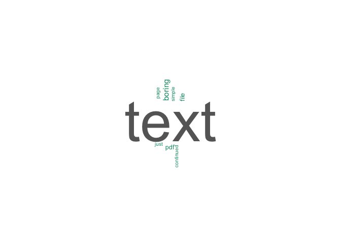
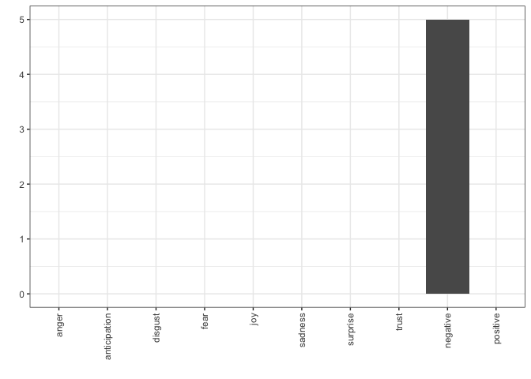

As a continuation on last week's blog entry, I am going to go into some text manipulation and visualization. In particular, I am going to show you how to create a word cloud and do a little sentiment analysis.

There are a number of packages we need here, but first, lets bring in that pdf again:


```r
library(pdftools)
```

```
## Warning: package 'pdftools' was built under R version 3.6.2
```

```r
library(dplyr)
pdf1<-pdf_text('samplePDF.pdf')
```

Remember, this comes in in an ugly format and we need to make it a more usable format. This will split the file on the "\n" (carriage return) character and will also unlist the character items and make this into a character vector. Much easier for us to work with.

**NOTE**: Notice that I have two commands here. You can do that in R, but remember that when you start to combine statements like I did below, you start to get code that is unreadable! I recommend no more that 2 commands per line. One if you are not laze like I am!


```r
pdf1<-unlist(strsplit(pdf1, split="\n"))
```

Now, we have just text. Lots of text! What can I do with this. Well, I could make a word cloud. You have seen these before. They show the most used word big and the lesser used words smaller? They are not the most useful thing in the world, but leadership likes them, so we are going to create one here!

I wish that we could just say "WORDCLOUD! GO!!!," but we need to do a little data munging first. For this, we will use the *tm* package. 

**NOTE** This also requires NLP. R is very nice that it will usually install the other required packages for you. NICE!


```r
library(tm)
```

```
## Loading required package: NLP
```

Now, we are going to do a number of operations on the character vector. Here we go!

First, I need to change the data into a corpus. A corpus is just kind of a bag of words.


```r
corpus<-iconv(pdf1)
corpus<-Corpus(VectorSource(corpus))
```

Now I need to start cleaning that data, changing all the words to lowercase, removing numbers and punctuation, and removing stopwords. Stopwords are words like "the", "and", "or", you know the stuff that you probably don't want to count. If you DO want to count these, than don't remove the stopwords!


```r
corpus<-tm_map(corpus, tolower)
```

```
## Warning in tm_map.SimpleCorpus(corpus, tolower): transformation drops documents
```

```r
corpus<-tm_map(corpus, removePunctuation)
```

```
## Warning in tm_map.SimpleCorpus(corpus, removePunctuation): transformation drops
## documents
```

```r
corpus<-tm_map(corpus, removeNumbers)
```

```
## Warning in tm_map.SimpleCorpus(corpus, removeNumbers): transformation drops
## documents
```

```r
corpus<-tm_map(corpus, removeWords, stopwords('english'))  ##stopwords where are spanish!
```

```
## Warning in tm_map.SimpleCorpus(corpus, removeWords, stopwords("english")):
## transformation drops documents
```

```r
cleanset<-tm_map(corpus, stripWhitespace)
```

```
## Warning in tm_map.SimpleCorpus(corpus, stripWhitespace): transformation drops
## documents
```

```r
tdm<-as.matrix(TermDocumentMatrix(cleanset))
```

BAM! Now I need a count of my word frequency and I need to put them in a pretty format so I can plot them.


```r
w<-rowSums(tdm)
w<-sort(rowSums(tdm), decreasing=TRUE)
w2<-data.frame(names(w), w)
names(w2)<-c("word","freq")
w2$word <- factor(w2$word, levels = w2$word[order(w2$freq,decreasing=TRUE)])
head(w2)
```

```
##          word freq
## text     text   40
## boring boring    4
## file     file    3
## pdf       pdf    3
## simple simple    2
## just     just    2
```

Pretty boring, but now lets make a wordcloud! The package I am going to use here is called "wordcloud," but there is another one that I recommend that you check out called "wordcloud2." It is pretty awesome and maybe I will do an entry about it later.


```r
library(wordcloud)
```

```
## Loading required package: RColorBrewer
```

```r
set.seed(222)
wordcloud(words=w2$word, freq=w2$freq, max.words=50,
          min.freq=2, colors=brewer.pal(8, 'Dark2'),
          scale=c(7, 0.3),
          rot.per=0.3)
```

<!-- -->

Okay, so maybe not the most interesting wordcloud. But, what is the sentiment of this data? One more package for this entry. It is called "syuzhet" and gives us the ability to bin our words into sentiment bins. Us this useful? Meh. I dunno. I am on the fence. But, it is a thing, so there is that. I am also going to bring in *ggplot2* for my visualization of the sentiment.


```r
library(ggplot2)
```

```
## 
## Attaching package: 'ggplot2'
```

```
## The following object is masked from 'package:NLP':
## 
##     annotate
```

```r
library(syuzhet)

wordvect<-rep(w2$word, w2$freq)
wordvect<-as.character(wordvect)

s<-get_nrc_sentiment(wordvect, language="english") #this package has sentiment
##for multiple languages!!

test1<-as.data.frame(colSums(s))
names(test1)<-"Count"
test1$names<-rownames(test1)
test1$names<-as.factor(test1$names)
test1$names<-factor(test1$names, levels=c("anger","anticipation" ,"disgust"  ,    "fear"      ,   "joy"     ,     "sadness"  ,    "surprise",
                       "trust","negative"  ,   "positive" ))
g<-ggplot(test1)+geom_bar(aes(x=names, y=Count), stat="identity")+
  theme_bw()+
  theme(axis.text.x = element_text(angle = 90, vjust = 0.5, hjust=1))+
  xlab("")+
  ylab("")
g
```

<!-- -->

Okay, so this sentiment analysis sucks. Mainly because I think that "text" is a negative context word and that is pretty much the only word that did anything. Bummer. But, we will explore more interesting data in days to come! Stay tuned!
